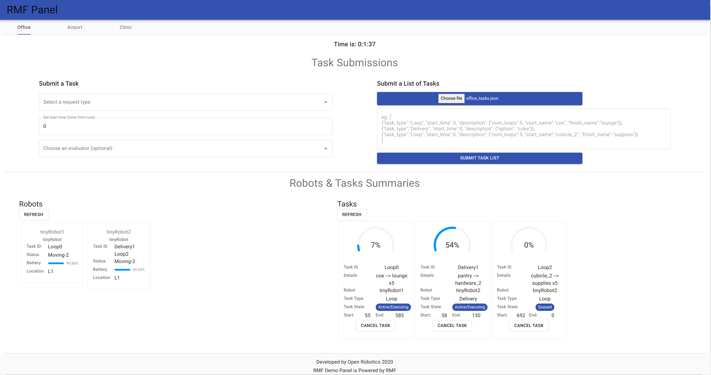
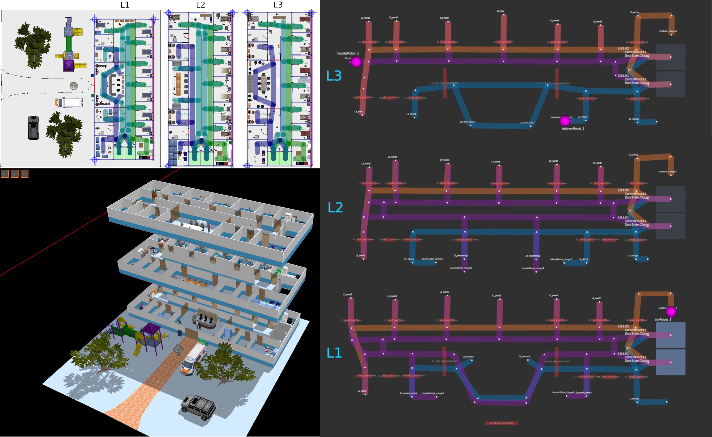
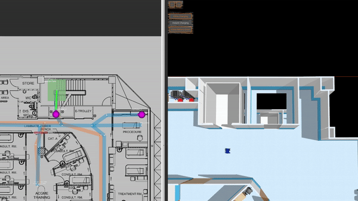
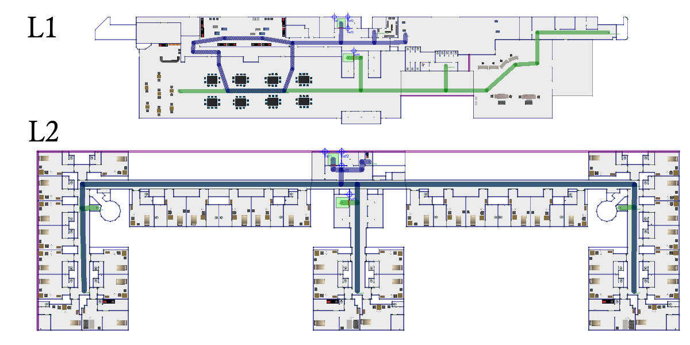
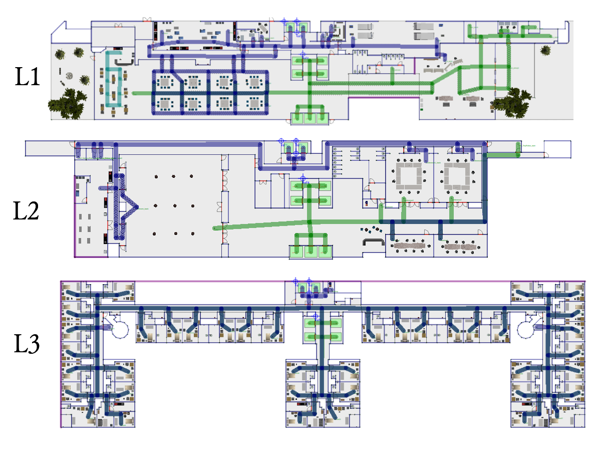
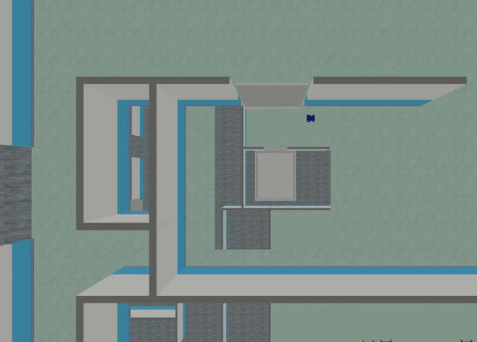

# RMF Demos


The Robotics Middleware Framework (RMF) enables interoperability among heterogeneous robot fleets while managing robot traffic that share resources such as space, building infrastructure systems (lifts, doors, etc) and other automation systems within the same facility. RMF also handles task allocation and conflict resolution  among its participants (de-conflicting traffic lanes and other resources). These capabilities are provided by various libraries in [rmf_core](https://github.com/osrf/rmf_core).

This repository contains demonstrations of the above mentioned capabilities of RMF. It serves as a starting point for working and integrating with RMF.

[](https://vimeo.com/405803151)

#### (Click to watch video)

## System Requirements

These demos were developed and tested on

* [Ubuntu 20.04 LTS](https://releases.ubuntu.com/20.04/)

* [ROS 2 - Foxy](https://index.ros.org/doc/ros2/Releases/Release-Foxy-Fitzroy/)

* [Gazebo 11.1.0](http://gazebosim.org/)

## Installation
Instructions can be found [here](docs/installation.md).

## FAQ
Answers to frequently asked questions can be found [here](docs/faq.md).

## RMF Panel


The RMF panel is a web based dashboard for interacting with RMF. It allows users to send task requests to RMF and monitor the status of robots and submitted tasks.
There are two main modes of submitting tasks to RMF via the Panel:

1. Submit a Task: Used to submit a single task. The user is required to first select a request type from the drop down menu. Depending on the type selected, additional fields specify to the type will need to be populated. The user can then specify the `start time` for the task before clicking `Submit Request`. 
2. Submit a List of Tasks: Used to submit a batch of tasks. A `.json` file containing a list of tasks may be loaded via the `Choose file` button. Some example files are found in `rmf_demo_tasks/rmf_demo_tasks`. Once loaded, clicking the `Submit Task List` button will automatically assign the various tasks to available robots.

Users may switch between different tabs on the top-left corner of the Panel when running the relevant demo world. More information on configuring the panel can be found [here](rmf_demo_panel/README.md)


## Demo Worlds

* [Office World](#Office-World)
* [Airport Terminal World](#Airport-Terminal-World)
* [Clinic World](#Clinic-World)
* [Hotel World](#Hotel-World)

> Note: When running the demos on Ubuntu 18.04 (not officially supported), you are required to explicitly supply gazebo_version launch argument. Eg:
ros2 launch demos office.launch.xml gazebo_version:=9

---

### Office World
An indoor office environment for robots to navigate around. It includes a beverage dispensing station, controllable doors and laneways which are integrated into RMF.

```bash
source ~/rmf_demos_ws/install/setup.bash
ros2 launch demos office.launch.xml
```

To send task requests, open RMF Panel from a browser
```bash
firefox localhost:5000
```

Alternatively, a launch file is configured to achieve the same result.

To submit a delivery task, select `Delivery` from the `Select a request type` dropdown list. Next, select `coke` from the `Select delivery task` list. Choose an desired start time for task and click submit.


To send loop requests, select `Loop` from the `Select a request type` dropdown list. Choose desired start and end locations and click submit.
To run a scenario with multiple task requests, load `office_tasks.json` from `rmf_demo_tasks/rmf_demos_tasks` in the `Submit a list of tasks` section. This should populate the preview window with a list of tasks. Click submit and watch the demonstration unfold.


The office dmeo can be run in secure mode using ROS 2 DDS-Security integration. Click [here](docs/secure_office_world.md) to learn more.

### Airport Terminal World

This demo world shows robot interaction on a much larger map, with a lot more lanes, destinations, robots and possible interactions between robots from different fleets, robots and infrastructure, as well as robots and users. In the illustrations below, from top to bottom we have how the world looks like in `traffic_editor`, the schedule visualizer in `rviz`, and the full simulation in `gazebo`,


#### Demo Scenario
To launch the world and the schedule visualizer,

```bash
source ~/rmf_demos_ws/install/setup.bash
ros2 launch demos airport_terminal.launch.xml
```

Load the `airport_terminal_tasks.json` list into RMF Panel and click submit to begin a collection of loop, delivery and cleaning tasks.

Non-autonomous vehicles can also be integrated with RMF provided their positions can be localized in the world. This may be of value at facilities where space is shared by autonomous robots as well as manually operated vechiles such as forklifts or transporters. In this demo, we can introduce a vehicle (caddy) which can be driven around through keyboard/joystick teleop. In RMF nomenclature, this vehicle is classified as a `read_only` type, ie, RMF can only infer its position in the world but does not have control over its motion. Here, the goal is to have other controllable robots avoid this vechile's path by replanning their routes if needed. The model is fitted with a plugin which generates a prediction of the vehicle's path based on its current heading. It is configured to occupy the same lanes as the `tinyRobot` robots. Here, a `read_only_fleet_adapter` submits the prediction from the plugin to the RMF schedule.

In the airport terminal map, a `Caddy` is spawned in the far right corner and can be controlled with `geometry_msgs/Twist` messages published over the `cmd_vel` topic. 


### Clinic World

This is a clinic world with two levels and two lifts for the robots. Two different robot fleets with different roles navigate across two levels by lifts. In the illustrations below, we have the view of level 1 in `traffic_editor` (top left), the schedule visualizer in `rviz` (right), and the full simulation in `gazebo` (bottom left).



#### Demo Scenario
To launch the world and the schedule visualizer,

```bash
source ~/rmf_demos_ws/install/setup.bash
ros2 launch demos clinic.launch.xml
```

Load the `clinic_tasks.json` list into RMF Panel and click submit to begin a collection of loop and delivery tasks.

Robots taking lift:



Multi-fleet demo:


---

### Hotel World

This is a hotel with a lobby and a guest level. The hotel has two lifts and two robot fleets. The tiny robots are supposed to guide the guests and the delivery robots are used to load and deliver cargo.

The hotel map is truncated due to the high memory usage. The full map can be accessed [here](https://github.com/MakinoharaShouko/hotel).

Hotel floor plan in `traffic_editor`:


Full hotel floor plan in `traffic_editor`:


#### Demo Scenario

To launch the world and the schedule visualizer,

```bash
source ~/rmf_demos_ws/install/setup.bash
ros2 launch demos hotel.launch.xml
```

Loop requests can be submitted via the RMF Panel.

Robot taking lift:


